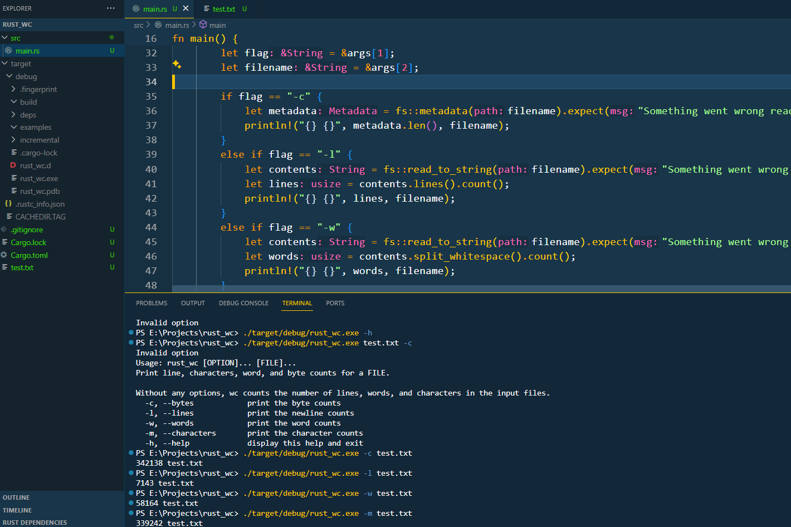

# Rust Word Count (rust_wc)

This is a simple version of the `wc` tool implemented in Rust. It counts the number of lines, words, and characters in a given file.

## Usage

To use the `rust_wc` tool, follow these steps:

1. Clone the repository:

    ```bash
    git clone https://github.com/adarsh0raj/rust_wc.git
    ```

2. Build the project:

    ```bash
    cd rust_wc
    cargo build
    ```

3. Run the executable:

    ```bash
    ./target/debug/rust_wc <flag> <file_path>
    ```

    Replace `<file_path>` and `<flag>` with the path to the file you want to count and the flag.

## Example

Here's an example of how to use the `rust_wc` tool:

```bash
./target/debug/rust_wc -l ./Cargo.toml
```

Available flags:
- `-c` or `--bytes`: print the byte counts
- `-l` or `--lines`: print the newline counts
- `-w` or `--words`: print the word counts
- `-m` or `--characters`: print the character counts
- `-h` or `--help`: display help and exit

## Screenshot

